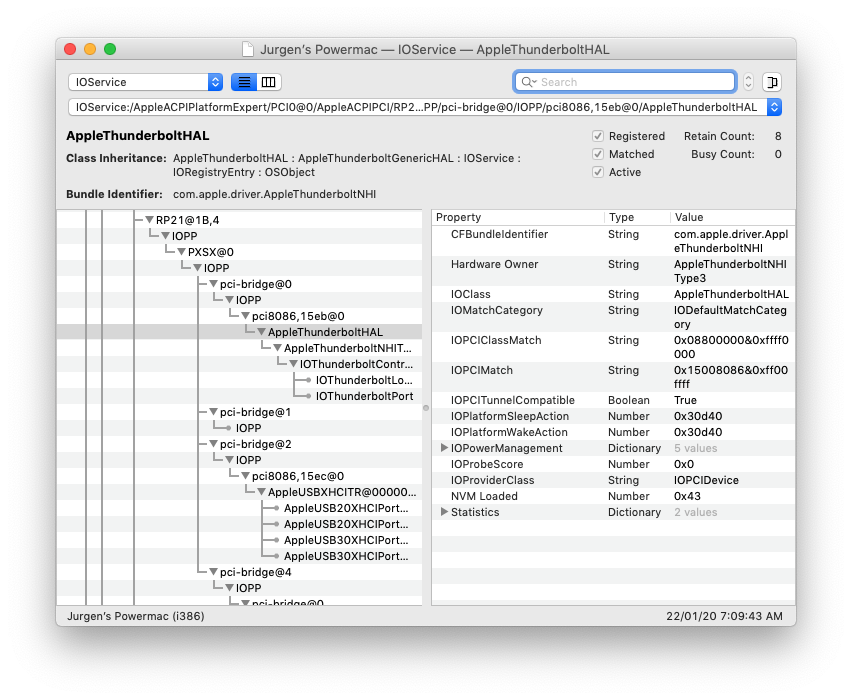
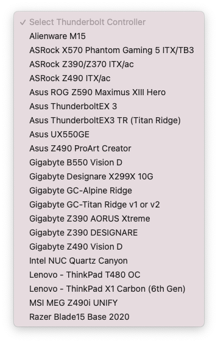

# 启用 Thunderbolt 4 热插拔

现在，您已了解有关 Thunderbolt 配置、固件和限制的足够信息，下一步是启用 Thunderbolt 热插拔。要启用热插拔，请按照下面列出的步骤操作。

## 获取 ACPI 路径
在开始准备 SSDT 之前，建议先找到 Thunderbolt 卡的 ACPI 路径。

### 对于单卡和板载 Thunderbolt：
连接任何 TB 设备并启动系统，以获得主板上 Thunderbolt 卡的 ACPI 路径。
现在一旦系统启动，下一步就是获取 ACPI 路径。要检查 ACPI 路径，只需打开 IOReg 并在搜索栏中键入 Thunderbolt。

您应该会在随附的屏幕截图中看到类似的内容。

找到 Thunderbolt 节点后，您可以清除搜索以获取完整的节点信息。

如果您查看，在上面的屏幕截图中，我们列出了一些 Thunderbolt 和 USB 连接器。您需要找到驱动与 Thunderbolt 连接的当前连接器。找出这一点的一个简单方法是使用 AppleThunderboltHAL 找到具有 Thunderbolt 属性的连接器。在我们的例子中，它是 PCI0/RP05/PXSX。您的系统可以有不同的系统。确保找到正确的位置。

### 对于多卡：
获取多卡的 ACPI 路径可能比单卡和板载 Thunderbolt 有点复杂。要查找多张卡的 ACPI 路径，请按照下面列出的步骤操作。
您可以安装所有 Thunderbolt 卡并一次获得多个 ACPI 路径，或者也可以在每个特定插槽中使用一张卡，然后一个接一个地获得 ACPI 路径。

要检查 ACPI 路径，只需打开 IOReg 并在搜索栏中键入 Thunderbolt。

在我们的例子中，这里有以下 ACPI 路径

**For Slot #2**
>RP21. PXSX
**For Slot #3**
>PC01.BR1A.SL01
**For Slot #5**
>PC03.BR3A.SL09

然而，这是 ACPI 路径的第一阶段。要完成第二阶段，您需要使用 Thunderbolt SSDT 并适应除 PXSX 之外的每个插槽，并记下新的 ACPI 路径。请注意，通常是它的 PEGP。但是，我们建议您通过第二阶段并确认 ACPI 路径，以确保没有侥幸。

**For Slot #3**
>PC01.BR1A.PEGP
**For Slot #5**
>PC03.BR3A.PEGP

## 获取示例 Thunderbolt SSDT
要获取示例 Thunderbolt SSDT，请按照以下步骤操作。

1. 在您的网络浏览器中打开HackinDROM网站。
2. 从下拉列表中选择您的 Thunderbolt 控制器。
3. 您将看到可用主板和 AIC 的列表，如下面的屏幕截图所示。该列表可能会发生变化。

### 对于单卡和板载 Thunderbolt：
如果您有板载 Thunderbolt 芯片或单 Thunderbolt 卡，只需从列表中选择合适的型号。

### 对于多个 Thunderbolt 卡：
如果您有多个 Thunderbolt 卡，该过程与板载和单个 Thunderbolt 卡略有不同。

1. 从列表中选择合适的 AIC 型号。