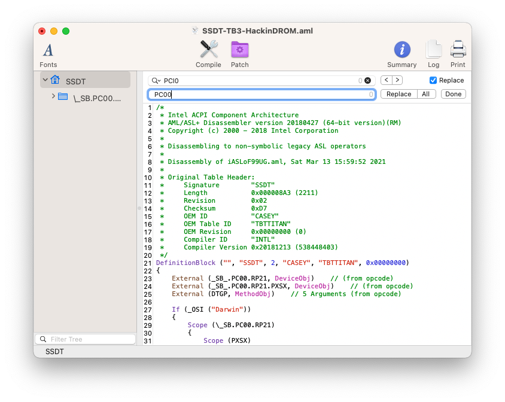
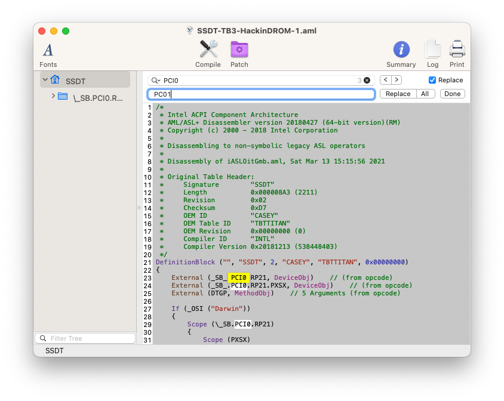
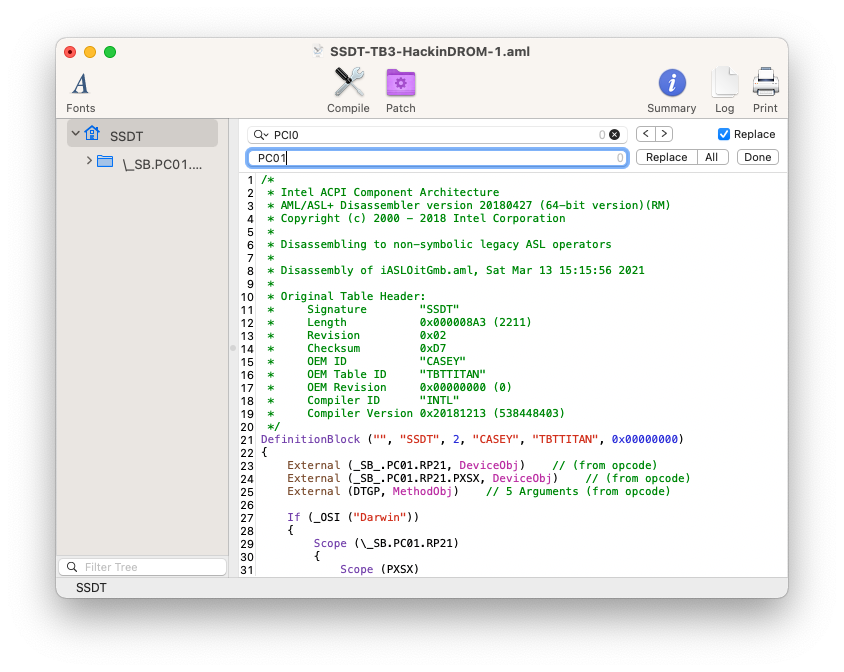
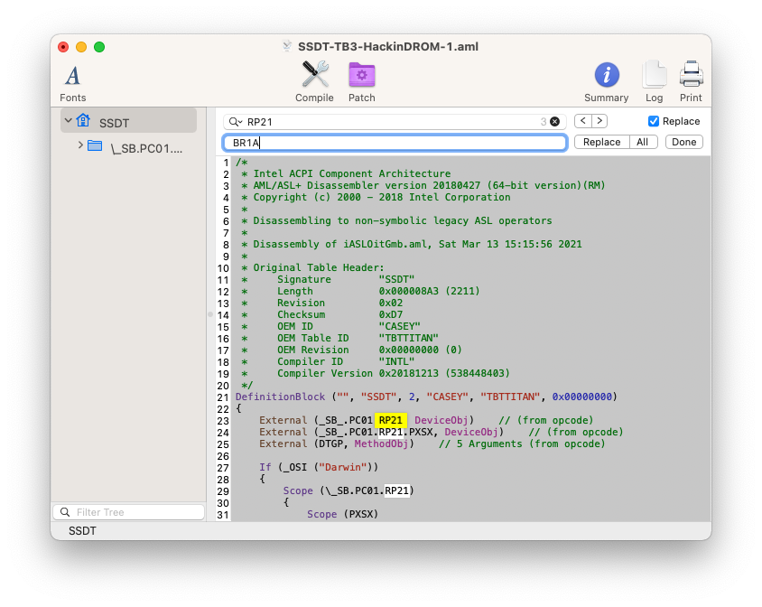
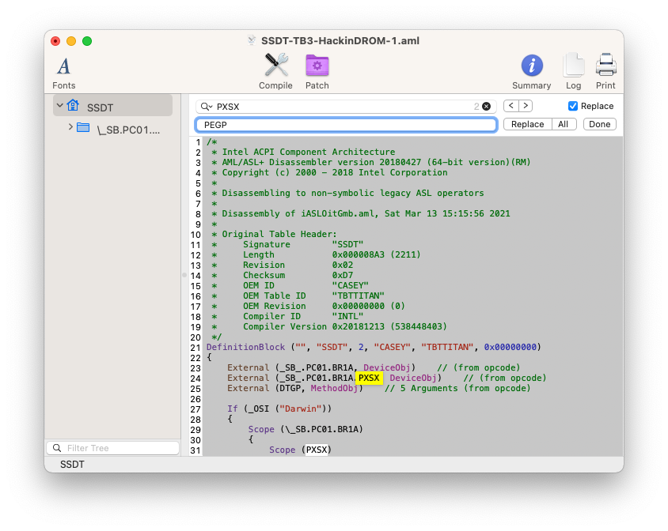
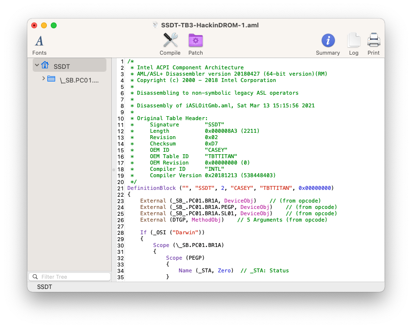
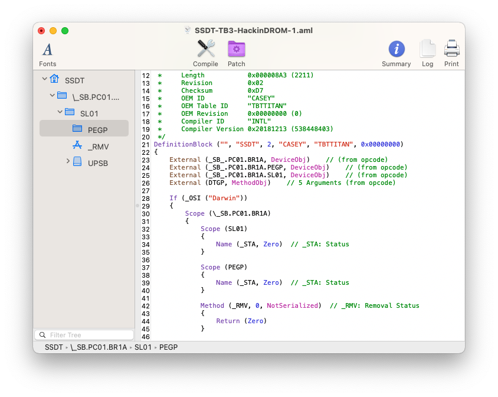

# 启用 Thunderbolt 4 热插拔

现在，您已了解有关 Thunderbolt 配置、固件和限制的足够信息，下一步是启用 Thunderbolt 热插拔。要启用热插拔，请按照下面列出的步骤操作。

## 获取 ACPI 路径
在开始准备 SSDT 之前，建议先找到 Thunderbolt 卡的 ACPI 路径。

### 对于单卡和板载 Thunderbolt：
连接任何 TB 设备并启动系统，以获得主板上 Thunderbolt 卡的 ACPI 路径。
现在一旦系统启动，下一步就是获取 ACPI 路径。要检查 ACPI 路径，只需打开 IOReg 并在搜索栏中键入 Thunderbolt。

您应该会在随附的屏幕截图中看到类似的内容。


找到 Thunderbolt 节点后，您可以清除搜索以获取完整的节点信息。


如果您检查一下，在上面的屏幕截图中，我们列出了一些 Thunderbolt 和 USB 连接器。您需要找到驱动与 Thunderbolt 连接的当前连接器。找出这一点的一个简单方法是使用 AppleThunderboltHAL 找到具有 Thunderbolt 属性的连接器。在我们的例子中，它是 PCI0/RP05/PXSX。您的系统可能不同。确保找到正确的位置。

### 对于多卡：
获取多卡的 ACPI 路径可能比单卡和板载 Thunderbolt 有点复杂。要查找多张卡的 ACPI 路径，请按照下面列出的步骤操作。
您可以安装所有 Thunderbolt 卡并一次获得多个 ACPI 路径，或者也可以在每个特定插槽中使用一张卡，然后一个接一个地获得 ACPI 路径。

要检查 ACPI 路径，只需打开 IOReg 并在搜索栏中键入 Thunderbolt。

在我们的例子中，这里有以下 ACPI 路径

**For Slot #2**
>RP21. PXSX

**For Slot #3**
>PC01.BR1A.SL01

**For Slot #5**
>PC03.BR3A.SL09

然而，这是 ACPI 路径的第一阶段。要完成第二阶段，您需要使用 Thunderbolt SSDT 并适应除 PXSX 之外的每个插槽，并记下新的 ACPI 路径。请注意，通常是它的 PEGP。但是，我们建议您通过第二阶段并确认 ACPI 路径，以确保没有侥幸。

**For Slot #3**
>PC01.BR1A.PEGP

**For Slot #5**
>PC03.BR3A.PEGP

## 获取示例 Thunderbolt SSDT
要获取示例 Thunderbolt SSDT，请按照以下步骤操作。

1. 在您的网络浏览器中打开[HackinDROM](https://hackindrom.zapto.org)网站。
2. 从下拉列表中选择您的 Thunderbolt 控制器。
3. 您将看到可用主板和 AIC 的列表，如下面的屏幕截图所示。该列表可能会发生变化。


### 对于单卡和板载 Thunderbolt：
如果您有板载 Thunderbolt 芯片或单 Thunderbolt 卡，只需从列表中选择合适的型号。

### 对于多个 Thunderbolt 卡：
如果您有多个 Thunderbolt 卡，该过程与板载和单个 Thunderbolt 卡略有不同。

1. 从列表中选择合适的 AIC 型号。

## 配置 TB 总线 ID
对于每个 Thunderbolt 卡，您需要配置 TB 总线 ID。这对于系统中安装的多个 Thunderbolt 控制器是必需的。每个唯一的总线 ID 代表每个唯一的 Thunderbolt 控制器。要配置总线 ID，请按照以下步骤操作。

1. 从列表中选择 AIC 模型后，单击自定义。
2. 在 TB Bus ID 下，更改 Bus ID。您可以使用从 0 或 1 开始的总线 ID，其中 0 或 1 属于第一个 Thunderbolt 卡。例如，如果您有 3 张 Thunderbolt 卡，并且您想从 0 开始使用 TB 总线，则分别为 0、1 和 2，如果您想要从 1 开始使用 TB 总线，则只需 1、2 和3分别。
3. 选择 TB 总线 ID 后，单击“编译”按钮。
4. 单击下载按钮，SSDT 将下载/保存到浏览器中系统配置的下载位置。

**笔记：**
- **要激活 Thunderbolt 总线，您需要将自定义固件刷写到您的 Thunderbolt 卡上。**
- **对于多张 Thunderbolt 卡，强烈建议您刷新网站，为每张卡配置 TB Bus ID，分别生成随机的唯一 ID (UID)。**
- **有PXSX地址的Slot，建议TB Bus ID为0，其余为1、2、3等。**

## 改变ACPI路径
现在，我们已经得到Thunderbolt的ACPI路径。要启用热插拔，您必须更改 ACPI 路径以匹配您的路径。

1、打开下载的SSDT

### 对于单卡和板载 Thunderbolt：
对于单卡和板载Thunderbolt，步骤很简单。

如果我们考虑我们的第一个 Thunderbolt 卡，它安装在插槽 #2 上，因为插槽 #1 是为 GPU 保留的，更改为 SSDT 将如下所示。
>PCI0>PC00

1. 要更改它，请按键盘上的 Command+F。
2. 单击右上角的替换复选框。
3. 在第一个搜索框中键入 PCI0，然后在第二个搜索框中键入 PC00。


4. 点击全部，变化如下图所示。


**注意事项：**
- **根据 IOReg，路径的其余部分不会更改，第一张卡的 ACPI 路径，对于插槽 #2，是 PC00.RP21.PXSX。**
- **对于在 IOReg 中以 PXSX 作为路径的 Slot，不需要进一步修改 SSDT。**

### 对于多个 Thunderbolt 卡：
对于多个 Thunderbolt 卡，您需要执行一些额外的步骤。

如果我们考虑我们的第二个 Thunderbolt SSDT，这里将是变化。
>PCI0>PC01

1. 要更改它，请按键盘上的 Command+F。
2. 单击右上角的替换复选框。
3. 在第一个搜索框中键入 PCI0，然后在第二个搜索框中键入 PC01。


4. 点击全部，变化如下图所示。


>RP21>BR1A

5. 在第一个搜索框中键入 RP21，然后在第二个搜索框中键入 BR1A。


6. 点击全部，变化如下图所示。


>PXSX>PEGP

7. 在第一个搜索框中键入 PXSX，然后在第二个搜索框中键入 PEGP。


8. 点击全部，变化如下图所示。


### 添加额外的外部定义块
如果您还记得“获取 ACPI 路径”的步骤，您可能已经注意到第二个 Thunderbolt 卡的路径是 PC01.BR1A.SL01，但我们在这里使用的是 PEGP。因此，我们需要添加 PC01.BR1A.SL01 并定义 SL01。为此，请按照以下步骤操作。

1. 复制以下外部方法。

```External (_SB_.PC01.BR1A.SL01, DeviceObj)    // (from opcode)```

2. 将其粘贴到外部 (DTGP) 行的正上方。
更改后，SSDT 应如下面的屏幕截图所示。



3. 复制以下范围
```
Scope (SL01)
            {
                Name (_STA, Zero)  // _STA: Status
            }
```

4. 将其粘贴到“Scope (PEGP)”行的正上方。
更改后，SSDT 应如下面的屏幕截图所示。


单击“编译”按钮并保存 SSDT。

**注意：**
- **对于系统中安装的每个 Thunderbolt 卡，您必须将 ACPI 路径替换为您的路径。**


