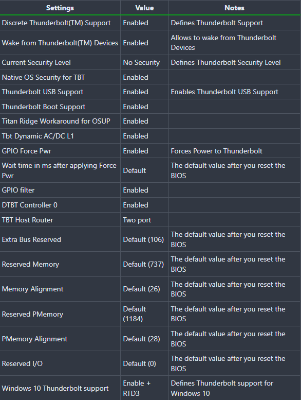

# 英特尔BIOS设置
- 注意：这些选项中的大多数可能不存在于固件中，建议尽可能地进行匹配，但如果这些选项中的许多选项在BIOS中不可用，也不要太在意。

## 关闭
- Fast Boot
- Secure Boot
- ~~Serial/COM Port~~
- ~~Parallel Port~~
- VT-d （如果将 `DisableIoMapper` 设置为 `YES` ，则可以开启）
- CSM （或者 UEFI Only）
- Thunderbolt (对于初始安装，如果未正确设置，Thunderbolt 可能会导致问题）
- ~~Intel SGX~~
- Intel Platform Trust
- CFG Lock （MSR 0xE2 写入保护）（**黑苹果无法在启用CFG-Lock时启动**）
  - **这必须关闭，如果找不到该选项则需要启用 `Kernel` -> `Quirks` 下的`AppleXcpmCfgLock`**

## 开启
- VT-x
- Above 4G decoding
- Hyper-Threading
- ~~Execute Disable Bit~~
- EHCI/XHCI Hand-off
- ~~OS type: Windows 8.1/10 UEFI Mode~~
- DVMT Pre-Allocated(iGPU Memory): 64MB 或 更高
- SATA Mode: AHCI

## 雷电

# 前置Windows步骤

## 7-Zip or Bandizip
[7-Zip](https://www.7-zip.org)

[Bandizip](https://www.bandisoft.com)

## Python
[Python](https://www.python.org)

# DSDT

## SSDTTime
>虽然通用文件很方便，但是使用工具提取出来的文件的适配性和兼容性更高

[SSDTTime](https://github.com/corpnewt/SSDTTime)

### 提取文件
>愿原力与你同在

运行 `SSDTTime.bat` 

选择 `Dump DSDT` 生成 `DSDT.aml` 文件（前置步骤，必须）

回到主菜单，选择 `FakeEC` 生成 `SSDT-EC.aml`、`SSDT-EC.dsl` 文件

回到主菜单，选择 `USBX` 生成 `SSDT-USBX.aml`、`SSDT-USBX.dsl` 文件

回到主菜单，选择 `PluginType` 生成 `SSDT-PLUG.aml`、`SSDT-PLUG.dsl` 文件

回到主菜单，选择 `RTCAWAC` 生成 `SSDT-RTCAWAC.aml`、`SSDT-RTCAWAC.dsl` 文件

~~回到主菜单，选择 `USB Reset` 生成 `SSDT-USB-Reset.aml`、`SSDT-USB-Reset.dsl` 文件~~

# U盘
## 工具
[gibMacOS](https://github.com/corpnewt/gibMacOS)

运行 `gibMacOS.bat`，选择 `Toggle Recovery-Only` ，选择带有 `- FULL Install` 字样的选项下载系统恢复镜像

## 插入U盘

**U盘设置为GPT格式**

## 写入U盘
>愿原力与你同在

运行 `MakeInstall.bat`，选择U盘序号，加上`Format as GPT (default is MBR).`选项字母

运行时需要输入系统恢复镜像的文件路径

# OpenCore
[OpenCore](https://github.com/acidanthera/OpenCorePkg)

解压提取 `X64` 目录下的 `EFI` 文件夹

视情况删除 `BOOT` 文件夹内 `.contentFlavour`、`.contentVisibility` 文件

视情况删除 `OC` 文件夹内 `.contentFlavour`、`.contentVisibility` 文件

## ACPI
将 `SSDT-PLUG.aml`、`SSDT-EC.aml`、`SSDT-USBX.aml`、`SSDT-RTCAWAC.aml`~~、`SSDT-USB-Reset.aml`~~ 移动到 `ACPI` 目录

## Drivers
只留下 `AudioDxe.efi`、`OpenCanopy.efi`、`OpenRuntime.efi` 文件，其他的都删掉

在 `Drivers` 目录下，下载 [HfsPlus.efi](https://github.com/acidanthera/OcBinaryData/blob/master/Drivers/HfsPlus.efi)

## Kexts

|       Name       | Version |
|:----------------:|:-------:|
|   **OpenCore**   |**0.9.0**|
|     VirtualSMC   |  1.3.1  |
|       Lilu       |  1.6.4  |
|   WhateverGreen  |  1.6.4  |
|     AppleALC     |  1.8.0  |
|   USBInjectAll   |    -    |
| XHCI-unsupported |    -    |
|    ~~NVMeFix~~   |~~1.1.0~~|

[VirtualSMC](https://github.com/acidanthera/VirtualSMC)
- VirtualSMC.kext
- SMCProcessor.kext
- SMCSuperIO.kext

[Lilu](https://github.com/acidanthera/Lilu)

[WhateverGreen](https://github.com/acidanthera/WhateverGreen)

[AppleALC](https://github.com/acidanthera/AppleALC)

[USBInjectAll](https://bitbucket.org/RehabMan/os-x-usb-inject-all/downloads)
- 黑果小兵版[USBInjectAll](https://github.com/daliansky/OS-X-USB-Inject-All)（适用500系、600系[?]主板）
- USB定制后可删除

[XHCI-unsupported](https://github.com/RehabMan/OS-X-USB-Inject-All)
- USB定制后可删除

~~[NVMeFix](https://github.com/acidanthera/NVMeFix)~~

~~[CtlnaAHCIPort](#Big-Sur-修复)~~

~~[AirportBrcmFixup](https://github.com/acidanthera/AirportBrcmFixup)~~
- ~~强制使用 `brcmfx-driver=` 加载特定的驱动程序可能会有所帮助~~
  - ~~以 BCM94352Z 为例，可能需要在 `boot-args` 中 使用`brcmfx-driver=2` 解决问题，其他芯片组将需要其他参数~~

~~[BrcmPatchRAM](https://github.com/acidanthera/BrcmPatchRAM)~~
- ~~BrcmBluetoothInjector.kext (MacOS 12-)~~
- ~~BrcmFirmwareData.kext~~
- ~~BrcmPatchRAM3.kext~~
- ~~BlueToolFixup.kext (MacOS 12+)~~
  - ~~不可在 macOS 12 或更新的系统下使用 `BrcmBluetoothInjector.kext`~~

## config.plist
将 `Docs\Sample.plist` 文件移动到 `EFI/OC/` 目录下，并且重命名为 `config.plist`

### 下载 ProperTree
[ProperTree](https://github.com/corpnewt/ProperTree)

### 编辑 config
>可以与旧版本的配置文件对比修改

运行 `ProperTree.bat` -> `File` -> `Open` -> 选择 `EFI/OC/config.plist`

删除顶部所有 `#WARNING` 条目

点击 `File` -> `OC Clean Snapshot` -> 选择 `EFI/OC` 目录

Booter -> Quirks -> DevirtualiseMmio -> true   
Booter -> Quirks -> EnableWriteUnprotector -> false   
Booter -> Quirks -> ProtectUefiServices -> true   
Booter -> Quirks -> RebuildAppleMemoryMap -> true   
Booter -> Quirks -> SetupVirtualMap -> false   
Booter -> Quirks -> SyncRuntimePermissions -> true

DeviceProperties -> Add -> 删除 `PciRoot(0x0)/Pci(0x1b,0x0)` 条目与 `layout-id`=`01000000` 字符

DeviceProperties -> 右键 `Add` 条目 -> 在 `Add` 条目下创建 `PciRoot(0x0)/Pci(0x2,0x0)` Dictionary   
DeviceProperties -> Add -> 右键 `PciRoot(0x0)/Pci(0x2,0x0)` 条目 -> 在 `PciRoot(0x0)/Pci(0x2,0x0)` 条目下创建 `AAPL,ig-platform-id` Data -> 值为 `07009B3E`   
DeviceProperties -> Add -> 右键 `PciRoot(0x0)/Pci(0x2,0x0)` 条目 -> 在 `PciRoot(0x0)/Pci(0x2,0x0)` 条目下创建 `device-id` Data -> 值为 `9B3E0000`
- 核显输出请查看 [修复HDMI](#修复HDMI)
- `framebuffer-stolenmem` 需要 BIOS 内的 `DVMT Pre-Allocated` 实际少于 64MB 或者没有该选项

DeviceProperties -> 右键 `Add` 条目 -> 在 `Add` 条目下创建 `PciRoot(0x0)/Pci(0x1F,0x3)` Dictionary   
DeviceProperties -> Add -> 右键 `PciRoot(0x0)/Pci(0x1F,0x3)` 条目 -> 在 `PciRoot(0x0)/Pci(0x1F,0x3)` 条目下创建 `layout-id` Data -> 值为 `0B000000`

DeviceProperties -> 右键 `Add` 条目 -> 在 `Add` 条目下创建 `PciRoot(0x0)/Pci(0x1B,0x2)/Pci(0x0,0x0)` Dictionary   
DeviceProperties -> Add -> 右键 `PciRoot(0x0)/Pci(0x1B,0x2)/Pci(0x0,0x0)` 条目 -> 在 `PciRoot(0x0)/Pci(0x1B,0x2)/Pci(0x0,0x0)` 条目下创建 `device-id` Data -> 值为 `F2150000`

DeviceProperties -> 右键 `Add` 条目 -> 在 `Add` 条目下创建 `PciRoot(0x0)/Pci(0x1,0x0)/Pci(0x0,0x0)/Pci(0x0,0x0)/Pci(0x0,0x0)` Dictionary   
DeviceProperties -> Add -> 右键 `PciRoot(0x0)/Pci(0x1,0x0)/Pci(0x0,0x0)/Pci(0x0,0x0)/Pci(0x0,0x0)` 条目 -> 在 `PciRoot(0x0)/Pci(0x1,0x0)/Pci(0x0,0x0)/Pci(0x0,0x0)/Pci(0x0,0x0)` 条目下创建 `shikigva` Number -> 80

Kernel -> Patch -> 右键 `Patch` 条目 -> 在 `Patch` 条目下创建一个新的条目 Dictionary   
Kernel -> Patch -> 新条目 -> 右键新条目 -> 在新条目下创建 `Base` String -> 值为 `__Z18e1000_set_mac_typeP8e1000_hw`   
Kernel -> Patch -> 新条目 -> 右键新条目 -> 在新条目下创建 `Comment` String -> 值为 `I225-V patch`   
Kernel -> Patch -> 新条目 -> 右键新条目 -> 在新条目下创建 `Count` Number -> 1   
Kernel -> Patch -> 新条目 -> 右键新条目 -> 在新条目下创建 `Enabled` Boolean -> True   
Kernel -> Patch -> 新条目 -> 右键新条目 -> 在新条目下创建 `Find` Data -> 值为 `F2150000`   
Kernel -> Patch -> 新条目 -> 右键新条目 -> 在新条目下创建 `Identifier` String -> 值为 `com.apple.driver.AppleIntelI210Ethernet`   
Kernel -> Patch -> 新条目 -> 右键新条目 -> 在新条目下创建 `MinKernel` String -> 值为 `19.0.0`   
Kernel -> Patch -> 新条目 -> 右键新条目 -> 在新条目下创建 `MaxKernel` String -> 值为 `20.4.0`   
Kernel -> Patch -> 新条目 -> 右键新条目 -> 在新条目下创建 `Replace` Data -> 值为 `F3150000`   

Kernel -> Quirks -> PanicNoKextDump -> true   
Kernel -> Quirks -> PowerTimeoutKernelPanic -> true   
Kernel -> Quirks -> XhciPortLimit -> true （运行 MacOS 11.3+ 则false，定制完USB也可以false）

Misc -> Debug -> AppleDebug -> true   
Misc -> Debug -> ApplePanic -> true   
Misc -> Debug -> DisableWatchDog -> true   
Misc -> Debug -> Target -> `3` （若需文件形式输出日志信息，则改为 `67`）   
Misc -> Security -> AllowSetDefault -> true   
Misc -> Security -> ScanPolicy -> `19858179`（[Opencore ScanPolicy Generator](https://github.com/i3p9/oc-scanpolicy) 生成所需的值，Opencore建议值为 `17760515`，调试值可为`0`）   
Misc -> Security -> SecureBootModel -> `j185`   
Misc -> Security -> Vault -> `Optional`

NVRAM -> Add -> 7C436110-AB2A-4BBB-A880-FE41995C9F82-> boot-args -> `-v keepsyms=1 debug=0x100 dk.e1000=0 e1000=0 agdpmod=pikera`   
NVRAM -> Add -> 7C436110-AB2A-4BBB-A880-FE41995C9F82-> prev-lang:kbd -> `656E2D55533A30`
- 删除 `#INFO (prev-lang:kbd)` 条目与 `en:252 (ABC), set 656e3a323532` 字符

UEFI -> APFS -> MinDate -> `20200306`   
UEFI -> APFS -> MinVersion -> `1412101001000000`   
UEFI -> Audio -> AudioDevice -> `PciRoot(0x0)/Pci(0x1F,0x3)`   
UEFI -> Audio -> AudioOutMask -> `-1`   
UEFI -> Audio -> PlayChime -> `Enabled`   

UEFI -> Input -> PointerSupportMode -> ``

#### 修改序列号
[GenSMBIOS](https://github.com/corpnewt/GenSMBIOS)

PlatformInfo -> Generic -> MLB ->    
PlatformInfo -> Generic -> ROM ->    
PlatformInfo -> Generic -> SystemProductName -> `iMac20,1`   
PlatformInfo -> Generic -> SystemSerialNumber ->    
PlatformInfo -> Generic -> SystemUUID -> 

## 替换文件
移动或替换 `EFI` 文件夹到U盘

# 启动
>硬盘必须是`GPT` 或 `GUID` 分区类型

## U盘启动
从U盘启动 MacOS 系统，并且测试是否正常

确保有线网络与无线网络至少有一个可以正常连接互联网

选择 `Disk Utility` 然后 `Continue`，选择安装 MacOS 系统所需的内置硬盘

选择 `Erase` ，重命名为 `Macintosh HD`，格式为 `APFS`，点击 `Erase`

回到恢复主界面，点击 `Reinstall macOS`、`Continue`

选择系统硬盘，点击 `Install`

等待一段时间，进入系统初始化界面

系统初始化完毕后，确认是否可以正常进入系统

## 移动 EFI 目录
打开 `Terminal` 

输入 `sudo diskutil list` 后回车，输入密码

显示出所有硬盘，找到 `TYPE` 和 `NAME` 都是 `EFI` 的硬盘，复制其 `IDENTIFIER` 值 (举例 `disk0s1`)

输入 `sudo diskutil mount ` 与硬盘的 `IDENTIFIER` 值 (举例 `sudo diskutil mount disk0s1`)，然后回车

将U盘内的 `EFI` 文件夹（在名为`BOOT`的硬盘下）移动或替换到新出现的 `EFI` 硬盘内

弹出U盘，测试系统重启与运行是否正常

# 修复

## 修复HDMI
>~~DP总线类型：2、4、5、6   ~~
>~~HDMI总线类型：1、2、4、6~~

~~应用补丁 -> 接口 -> 红色则为DP接口，明确`索引`和`总线ID`~~

~~将剩余条目的`类型`由`DP`改为`HDMI`，修改总线ID~~

~~点击屏幕左上角`文件` -> `导出` -> `引导工具 Config.plist`~~
- ~~(con0~2) * busID(1,2,4,6)~~

~~选择 `EFI/OC` 目录，确认替换 `config.plist`~~

~~重启系统并测试 HDMI~~

因为10代CPU (Comet Lake) 搭配Z590系列主板，在MacOS下无法驱动板载视频输出

所以HDMI接口与DP接口都不能正常地输出视频信号

NVRAM -> Add -> 7C436110-AB2A-4BBB-A880-FE41995C9F82-> boot-args -> 加入 ` -igfxvesa igfxonln=1`

**无独显情况下**加入 ` -igfxvesa igfxonln=1` 以进入系统进行调试等设置，HDMI与DP均能显示，**无需定制、修复**，**也无法修复**（但显存为7MB）
- ` -igfxvesa igfxonln=1` 仅作调试用途，排除故障，不建议在工作环境下使用

后续接入独立显卡，调试完成独立显卡后，可删除 ` -igfxvesa igfxonln=1`

## 修复USB

重启系统并且测试

## 修复开机提示音

[修复开机提示音](https://dortania.github.io/OpenCore-Post-Install/cosmetic/gui.html)

# Big Sur 修复
## AirportBrcmFixup
- 强制使用 `brcmfx-driver=` 加载特定的驱动程序可能会有所帮助
  - 以 BCM94352Z 为例，可能需要在 `boot-args` 中 使用`brcmfx-driver=2` 解决问题，其他芯片组将需要其他参数

## XhciPortLimit
Kernel -> Quirks -> XhciPortLimit -> false

## SATA 支持受损
- 由于 Apple 在 AppleAHCIPort.kext 中 删除了 AppleIntelPchSeriesAHCI 类
- 解决这一问题，添加 Catalina 的补丁[CtlnaAHCIPort.kext](https://github.com/dortania/OpenCore-Install-Guide/blob/master/extra-files/CtlnaAHCIPort.kext.zip)（AppleAHCIPort.kext）并将 `MinKernel` 设为 `20.0.0`
- 常见于笔记本电脑在Big Sur及更新的系统版本[?]，在MacOS中不识别内置 SATA 硬盘驱动器的话，可以考虑使用；建议在不使用的环境下测试
- 使用该kext后不能进行SATA热插拔

# Monterey 修复
>[BrcmPatchRAM](https://github.com/acidanthera/BrcmPatchRAM)

BrcmBluetoothInjector.kext
- 如果仍然启动 Big Sur 及更早版本的系统，应在 config.plist 中将该 kext 的 `MaxKernel` 字段设置 `20.99.9`

保留 BrcmFirmwareData.kext   
保留 BrcmPatchRAM3.kext

加入 [BlueToolFixup](https://github.com/acidanthera/BrcmPatchRAM)
- 如果仍然启动 Big Sur 及更早版本的系统，应在 config.plist 中将该 kext 的 `MinKernel` 字段设置 `21.00.0` 以防止在旧系统上加载 BlueToolFixup

# 其他

## 修复Windows时间
更改Windows注册表

`Reg add HKEY_LOCAL_MACHINE\SYSTEM\CurrentControlSet\Control\TimeZoneInformation /v RealTimeIsUniversal /t REG_DWORD /d 1`

恢复Windows注册表

`Reg add HKEY_LOCAL_MACHINE\SYSTEM\CurrentControlSet\Control\TimeZoneInformation /v RealTimeIsUniversal /t REG_DWORD /d 0`
